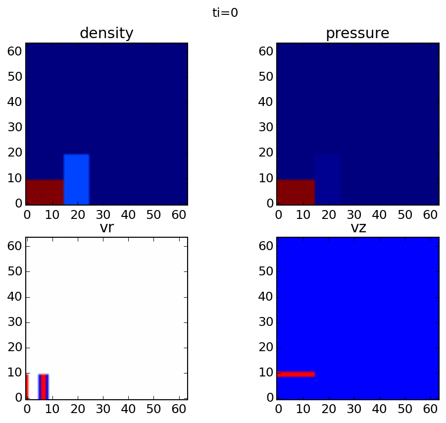

.. image:: https://zenodo.org/badge/32956122.svg
   :target: https://zenodo.org/badge/latestdoi/32956122

.. image:: https://travis-ci.org/scivision/pyLCPFCT.svg?branch=master
    :target: https://travis-ci.org/scivision/pyLCPFCT

.. image:: https://coveralls.io/repos/github/scivision/pyLCPFCT/badge.svg?branch=master 
    :target: https://coveralls.io/github/scivision/pyLCPFCT?branch=master

==============
python-lcpfct
==============
NRL Flux-Corrected Transport algorithm for Solving Generalized Continuity Equations--now in Python with Examples!

demonstrates use of Fortran code called from Python. 
In this case, using Fortran code as a Python module is about 50 times faster than the very slow writing Fortran output to a text file, and parsing the text in Python or Matlab.

Install
=======
For the Python wrapping Fortran::

    pip install -e .

(optional) to use just Fortran alone::
    
    cd bin
    cmake ..
    make

Examples
========

2-D explosion
-------------
::

    ./runfast2d.py

1-D shock 
----------
::

    ./runshock.py

References
==========

https://www.nrl.navy.mil/lcp/LCPFCT
